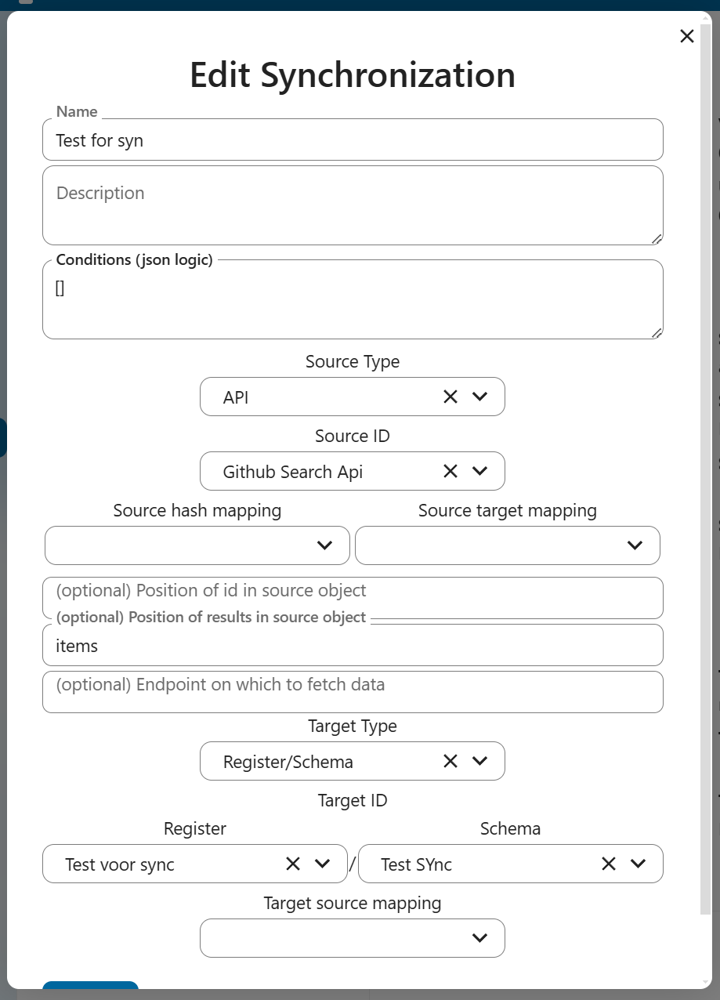

# Synchronization

Synchronization is a core feature that enables data transfer between different systems and APIs. Here's how it works:

## Overview
- Synchronizations define how data should be synchronized between a source and target system
- Each synchronization has a source configuration (where to get data from) and target configuration (where to send data to)
- The synchronization process handles pagination, data mapping, and maintaining sync state

## Key Components

### Source Configuration
- Defines where to fetch data from (API endpoint, database etc)
- Specifies how to map source data to target format (incomming data)
- Specifies how to locate objects in the response using resultsPosition:
  - `_root`: Uses the entire response body as the objects array
  - Dot notation (e.g. `data.items`): Extracts objects from a nested path
  - Common keys (`items`, `result`, `results`): Automatically checks these standard locations
  - Custom path: Specify any JSON path to locate the objects
- Configures pagination settings (paginationQuery)
- Can include conditions to filter which objects to sync using JSON Logic
- Source type can be set to API or other supported types
- Source ID mapping allows specifying position of IDs in source objects
- Optional endpoint configuration for fetching data

### Target Configuration 
- Defines where to send synchronized data
- Specifies how to map target data to source format (outgoing data)
- Handles create/update/delete operations
- Target type can be Register/Schema or other supported types
- Target ID and schema selection for Register/Schema targets
- Target source mapping for data transformations

### Synchronization Contracts
- Tracks the sync state for each individual object
- Stores origin ID and target ID mappings
- Maintains hashes to detect changes
- Logs synchronization events and errors

## Process Flow
1. Fetch objects from source system with pagination
2. Filter objects based on configured conditions
3. Create/update synchronization contracts for each object
4. Transform data according to mapping rules
5. Write objects to target system (POST/PUT/DELETE)
6. Update contract status and hashes
7. Handle any follow-up synchronizations

## Error Handling
- Rate limiting detection and backoff
- Logging of failed operations
- Contract state tracking for retry attempts

The synchronization system provides a robust way to keep data in sync across different systems while maintaining state and handling errors gracefully.

## Form Configuration
The synchronization form allows configuring:

- Name: Descriptive name for the synchronization
- Description: Optional details about the synchronization
- Conditions: JSON Logic conditions for filtering objects
- Source Configuration:
  - Source Type: API or other supported types
  - Source ID: Selection of configured source
  - Source hash mapping: Hash configuration
  - Source target mapping: Data mapping rules
  - Position of ID in source object (optional)
  - Position of results in source object (optional)
  - Custom endpoint for data fetching (optional)
- Target Configuration:
  - Target Type: Register/Schema or other types
  - Target ID: Selection of target system
  - Register and Schema selection for Register/Schema targets
  - Target source mapping: Data transformation rules
- Test sync option to validate configuration

