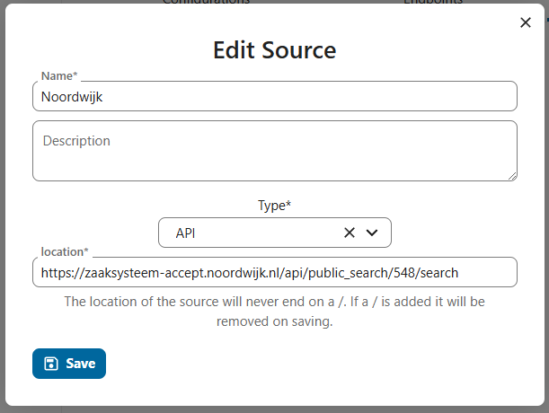
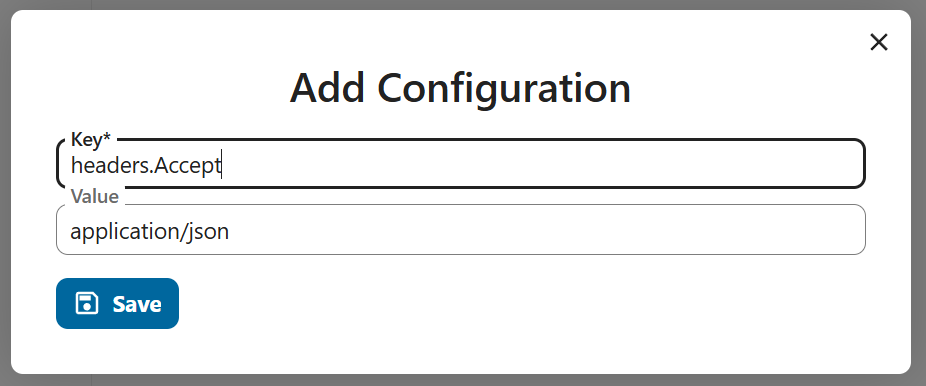
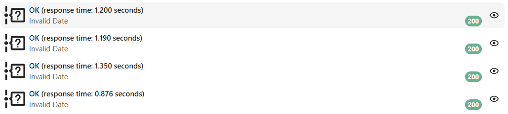
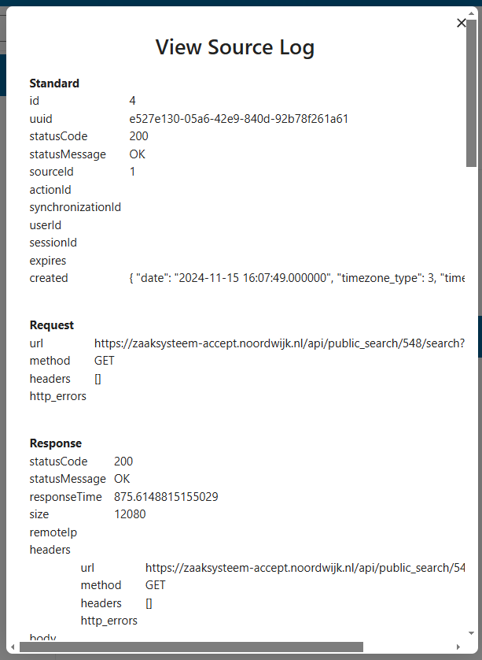

# source

## Source

A source is a representation of an external service that the connector can connect to. That may be a database, a file or any other kind of service but its typically an api.

### Basic setup



* Name: The name of the source. This is used in the ui to identify the source.
* Description: The description of the source. This is used in the ui to describe the source.
* Type: The type of the source. This is used to determine how to call the source.
* Location: The location of the source. This is typically the url of the api.

### Authentication

Most sources require some form of authentication. The exact form depends on the source. For security reasons the authentication method is part of the vault and not the source. If you want to authenicate against an external service you need to add an authentication to the vault and then ad it to the source. Each source can have multiple authentications methods (e.g. both a certiciate and a password).

### Synchronysations

Synchronysations are managed trough the synchronysations, you can however view all the synchronysations for a source in the source synchronysations tab.

@todo add screenshots

### Configuration

Sources are called trough the call service. The call service is responsible for making the call to the source and for handling the response. The call service is based on the pubpular [guzzle library](https://docs.guzzlephp.org/en/stable/). That means all guzzle options are supported trough the source configuration. This is done bij adding a configuration to the source. Configurations are defined in a dot.note format.

E.g. headers can be added to the call by adding the following configuration to the source

headers.Accept = application/json



Will lead to the following configuration on the call service:

```
headers:
  - name: Accept
    value: application/json 
```

the most common options are:

* headers
* query

But all [guzzle options](https://docs.guzzlephp.org/en/stable/request-options.html) are supported. So for example you can change the timeout of the call by adding the following configuration to the source:

timeout = 10

## Loggin

The call service logs both the request and the response. These logs are vieuwable in the UI under the apropriate source.





@todo configuring the log retention period
