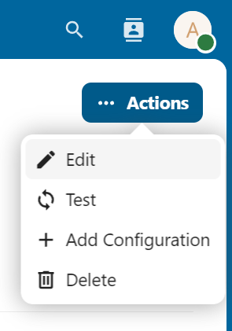
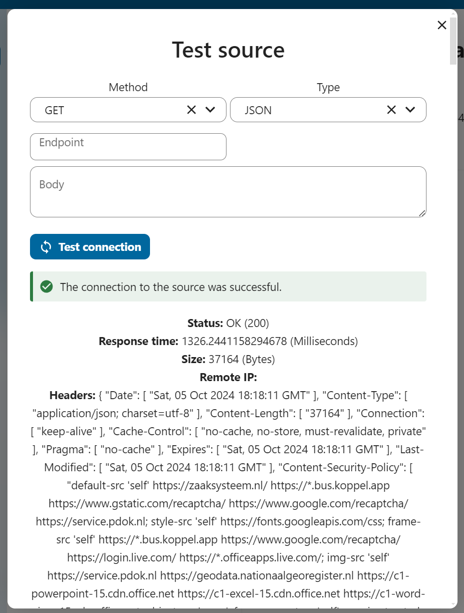

# xxllnc To Publication

This document outlines the connection between the [**xxllnc**](https://xxllnc.nl/teams/zaakgericht) **(Zaaksysteem) Search API** and the **Publication Register** (and its core object, the Publication object).

## Overview

The x**xllnc (Zaaksysteem)** is a system used by the Dutch government to manage and publish administrative decisions. Its Search API is a RESTful service that provides access to data within the xxllnc case system.

The **Publication Register** is a platform designed to manage and publish administrative decisions, with the **Publication object** as its central data element.

## Preperation

Make sure you have the following information:

* The base url of the seqarch api
* An installtion of Open Register
* An configuration of the Publication Register on Open Register
* An insatllation of Open Connector

## Setting up the connection

Create a new source (connection), set the type to API and location to the base url of the xxlnc search api. Since the search api is public to start with no addiotnal configuration is nessesarry.

Open the source and click on 'Test' in the action menu. This wil open the test dialog. Presss test and you will see the data that is available.

 

I everything checks out we can write down the source id and are now ready to setup a mapping.

## Setting up the mapping

Mappings are used to map the data from object A tot object B or visa versa. In the case of the xxlnc search api we need to create a mapping between the search api and the publication register publication object. And the attachement object.
