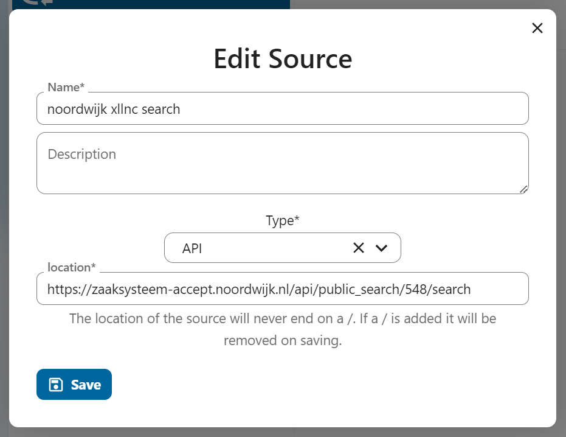

 #  ZGW to and from xxllnc zaaksysteem

 This document describes the connection between the Xxllnce (zaaksysteem) v1 and v2 api and the Zaak Register (ZGW configured on OpenRegister and OpenConnector).

 ## Overview

 The xxllnc zaaksysteem is a system used by the Dutch government to manage and publish administrative decisions. The v1 and v2 apis are used to fetch and write cases, casetypes and files.

 The Zaak Register is a system used to manage all sorts of municipality cases. The Zaak object is the core object in the Zaak Register.

 ## Preparation 

 Make sure you have the following information:

 - The base url of the v1 and v2 api
 - An installation of Open Register and Open Connector
 - An configuration of the Zaak Register (ZGW) on Open Register
 
 ## Setting up the connection

 Create a new source (connection), set the type to API and location to the base url of the xxllnc v1 api. This api needs a API-KEY and a API-Interface-ID

 <!--  -->

 
Open the source and click on 'Test' in the action menu. This  wil open the test dialog. Presss test and you will see the data that is available.

<!--   -->

I everything checks out we can write down the source id and are now ready to setup a mapping.

## Setting up the mapping

Mappings are used to map the data from object A tot object B or visa versa. In the case of the xxlnc v1 api we need to create a mapping between the v1 api and the publication ZGW Zaak object.