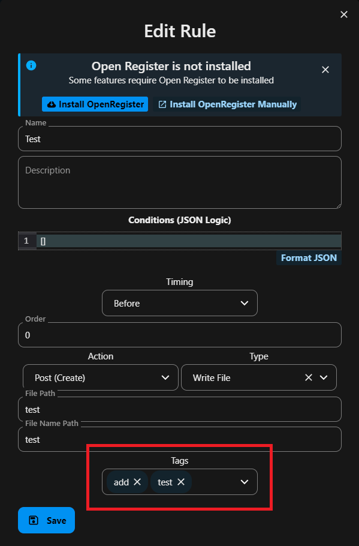

# Rules

Rules are components that can be associated with endpoints to add additional functionality. Based on the current codebase, rules are stored as string IDs and can be attached to multiple endpoints.

## Adding Rules to Endpoints

Rules can be added to endpoints through the AddEndpointRule modal component. The process works as follows:

1. Select a rule from the available rule options dropdown
2. The rule ID is added to the endpoint's `rules` array property
3. The endpoint is updated with the new rule association
4. On success, the modal closes automatically after 2 seconds

## Rule Properties

Rules have several key properties that define their behavior:

- uuid: A unique identifier string for the rule
- name: The display name of the rule
- description: A detailed description of the rule's purpose
- action: Specifies when the rule triggers (create, read, update, delete)
- timing: Controls if rule runs 'before' or 'after' the action (defaults to 'before')
- conditions: JSON Logic format conditions that determine when rule applies
- type: The rule type (mapping, error, script, synchronization, authentication, download, upload, locking)
- configuration: Type-specific configuration stored as JSON
- order: Integer determining execution order when multiple rules exist

The properties work together to define:

1. When the rule executes (action + timing)
2. Under what conditions it runs (conditions)
3. What functionality it provides (type + configuration)
4. The sequence of execution (order)

Rules are stored in a structured format but referenced by endpoints using their UUID strings in an array format.

## Rule Implementation

The current implementation shows:

- Rules are managed through a dedicated API endpoint at `/api/rules`
- Rules can be retrieved and managed through the Rules resource controller
- Rule IDs are stored and validated as strings within endpoints
- The endpoint entity ensures rules are always stored as an array

## Rule Types

### Authentication Rules

Authentication rules control access to endpoints by validating user credentials and permissions. Configuration options include:

- type: The authentication method to use
  - basic: Basic HTTP authentication
  - jwt: JSON Web Token authentication
  - jwt-zgw: ZGW-specific JWT authentication
  - oauth: OAuth 2.0 authentication
- users: Array of specific users allowed to access the endpoint
- groups: Array of user groups allowed to access the endpoint

### Download Rules

Download rules handle file access and retrieval. Configuration includes:

- fileIdPosition: Specifies the position of the file ID in the URL path
- Automatic validation of user access rights to requested files

### Upload Rules

Upload rules manage file upload functionality and restrictions. Configuration includes:

- path: The target directory path for uploaded files
- allowedTypes: Comma-separated list of allowed file extensions (e.g., jpg,png,pdf)
- maxSize: Maximum allowed file size in megabytes

#### Partial upload rules

Partial upload rules manage file uploads in multiple parts, allowing for uploads of larger files.
Partial uploads require the created object to contain the file size of the file to be created.

The functionality is split into two rule types:

- `fileparts_create`
- `filepart_upload`

The `fileparts_create` type creates the partial file upload from the endpoint. These partial files will be nested into
the response object, and will be stored with their ids in the saved object. The fileparts will be stored in objects according to a separate schema.

The default schema of these fileparts is:

```json
{
    "id": "baed4312-c6b8-48bc-a1b3-c3536d9653be", // The id of the file part object.
    "order": 1, // The order number of the file part, starting at 1
    "size": 297809, // The size in bytes of the file part that is/will be uploaded
    "data": "..." // The data uploaded. This will only exist after uploading, until the data is written into a partial file.
}
```

The `fileparts_create` rule takes the following configuration:

- `sizeLocation` (required): The location in the created object containing the size of the complete file.
- `schemaId` (required): The schema to store the file part in.
- `filenameLocation` (optional): The location in the created object that contains the filename of the file to be created. This defaults to `filename` if it is not set.
- `filePartLocation` (optional): The location in the created object the created fileparts will be written to. Defaults to `fileParts`
- `mappingId` (optional): If the resulting filePart objects have to be mapped to a specific format, the id of the mapping that will map the file parts to the desired format.

The `filepart_upload` type will upload the data in the file part that is uploaded into a temporary file, and
once all fileparts have been uploaded, it will reconcile the partial uploads into one file (deleting the temporary files,
and if no additional data has been put into the folder where the parts are stored, the folder).

The `filepart_upload` rule takes the following configuration:

- `mappingId` (optional): If the file parts are in a specific format, the mapping to map the fileparts to the default format. (Usually this means that this is the inverse mapping of `mappingId` in the corresponding `fileparts_create` rule).

### Locking Rules

Locking rules provide exclusive access control for resources. Configuration includes:

- action: The locking operation to perform
  - lock: Lock a resource for exclusive access
  - unlock: Release a previously locked resource
- timeout: Duration in minutes before the lock automatically expires

## Tags in Rules

For the type fetch file and write file you can add tags that will be attached to the files. When fetching these files from OpenRegister in any way will result in the tags also being readable.




## Rule Validation

When adding rules to an endpoint:

- The rules array is initialized if it doesn't exist
- Existing rule IDs are converted to strings
- New rule IDs are validated before being added
- The endpoint is revalidated after rule changes

## Error Handling

The rule addition process includes:

- Validation that a rule is selected before saving
- Error catching and display if the save fails
- Loading state management during the save process
- Success/error message display to the user
