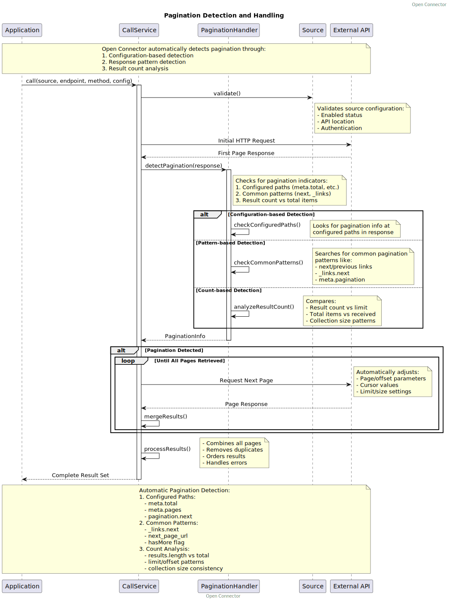

import Tabs from '@theme/Tabs';
import TabItem from '@theme/TabItem';

# Source

A Source in Open Connector represents a digital endpoint that can be used for data exchange. Sources can function both as data providers and destinations, enabling bidirectional data flow. The actual data transfer process is managed through Synchronizations.

## Types of Sources

Open Connector supports three main types of sources:

1. **Nextcloud Files**
   - Internal file system integration
   - Direct access to files within your Nextcloud environment

2. **External APIs**
   - REST/HTTP-based services
   - Third-party application interfaces
   - Cloud services
   - External files like CSV, JSON, XML, etc.

3. **External Databases** (Deprecated)
   > ⚠️ **Note:** Database connections are deprecated. For database interactions, we recommend using [Open Registers](https://open-registers.com) as a more robust solution.

## Core Concepts

### Purpose
A Source defines:
- The location of the data endpoint
- Authentication methods
- Connection parameters
- Basic interaction rules

### Authentication
Sources can use various authentication methods:
- API Keys
- OAuth2
- Basic Authentication
- Custom Headers

## Procces 
Calls to a source are made trought the open conncetor call service, this is essentiall a wrapper around the guzzle http client. But it gives some adtional features like logging, caching and error handling and dealing with pagination ans xml files. The call service is a technical service that takes as input a source object (and optionally an endpoint, method and configuration if the default ones need to be overwritten) and returns and array of objects as a result. The call service is used by the synchronysations to get the data from the source.

## Configuration

Sources have the following configurable properties:

| Property | Type | Description | Default |
|----------|------|-------------|---------|
| uuid | string | Unique identifier for the source | null |
| name | string | Display name of the source | null |
| description | string | Detailed description of the source | null |
| reference | string | External reference identifier | null |
| version | string | Version number of the source | '0.0.0' |
| location | string | URL or path to the source | null |
| isEnabled | boolean | Whether the source is active | null |
| type | string | Type of source (api, file or database) | null |
| loggingConfig | array | Logging configuration | null |
| configuration | array | General configuration | null |
| rateLimitLimit | integer | Total allowed requests per period | null |
| rateLimitRemaining | integer | Remaining allowed requests | null |
| rateLimitReset | integer | Unix timestamp for limit reset | null |
| rateLimitWindow | integer | Seconds between requests | null |
| lastCall | datetime | Timestamp of last API call | null |
| lastSync | datetime | Timestamp of last sync | null |
| dateCreated | datetime | Creation timestamp | null |
| dateModified | datetime | Last modified timestamp | null |


Sources are configured using Guzzle HTTP client options. These settings control how Open Connector interacts with the source. That means that the configuration is passed as an array to the Guzzle client with one aditiondal option and thats that the method of the call can be set trought the method property (defaults to `GET`). The baser_uri is overwritten by the location property of the source.

### Example Source Configurations

```json
{
    "base_uri": "location-from-source",
    "method": "GET",
    "headers": {
        'Authorization' => 'Bearer your-token',
        'Accept' => 'application/json',
    ],
    'timeout' => 30,
]
```

For detailed configuration options, refer to the [Guzzle Documentation](https://docs.guzzlephp.org/en/stable/request-options.html).

### Dealing with pagination

Open Connector provides robust support for handling paginated API responses. The system can automatically detect and handle various pagination patterns commonly used in APIs.

#### Pagination Configuration

Pagination can be configured in the source configuration using the following structure:

```json
{
    "pagination": {
        "type": "offset",              // Type of pagination (offset, page, cursor)
        "paginationQuery": "page",     // Query parameter for pagination
        "limitQuery": "limit",         // Query parameter for items per page
        "page": 1,                     // Starting page/offset
        "limit": 100,                  // Items per page
        "totalPages": "meta.pages",    // Path to total pages in response
        "totalItems": "meta.total",    // Path to total items in response
        "hasMore": "meta.has_more",    // Path to has_more indicator
        "cursor": "meta.next_cursor"   // Path to next cursor (for cursor pagination)
    }
}
```

#### Supported Pagination Types

1. **Offset-based Pagination**
   ```json
   {
       "pagination": {
           "type": "offset",
           "paginationQuery": "offset",
           "limitQuery": "limit",
           "page": 0,
           "limit": 100
       }
   }
   ```

2. **Page-based Pagination**
   ```json
   {
       "pagination": {
           "type": "page",
           "paginationQuery": "page",
           "limitQuery": "per_page",
           "page": 1,
           "limit": 50
       }
   }
   ```

3. **Cursor-based Pagination**
   ```json
   {
       "pagination": {
           "type": "cursor",
           "paginationQuery": "cursor",
           "limit": 100,
           "cursor": "meta.next_cursor"
       }
   }
   ```

#### Response Handling
APIs typically return data in a wrapped format. The Call Service needs to know where to find the actual result objects. Here are common patterns:

1. Detecting the response wrapper structure
   - Looks for common result properties in order:
     - `results`
     - `items` 
     - `result`
     - `data`
   - Throws error if no valid wrapper property found
   - Can be configured to handle unwrapped responses via `_root` setting

2. Afther the call service has fetched the data it will return an array of objects on the current page. The call service will then try to dermine if the result is paginated. It will assume that it always starts on page 1 of a paginated responce and the look if:
   - The next cursor (from `next`, `next_page`, `next_cursor`, `nextPage`, `nextCursor`) is pressent and an url. It wil then follow the url and fetch the next page.
   - The total number of results (from `total`, `totalResults`, `total_results`, `totalResults`, `total_items`, `totalItems`, `total_data`, `totalData`) is greater than the current number of results
   - The next cursor (from `next`, `next_page`, `next_cursor`, `nextPage`, `nextCursor`) is higher then the current page counter (if tis a integer). 
   - The current page is less then the total number of pages (from `totalPages`, `total_pages`, `pages`)

If the call service detects that the result is paginated it will fetch the next page and return the results. It will also update the source with the new page number and total number of pages.

It will continue in this loop until it has fetched all the pages and returned all the results, the configuration.max_pages limit has been reachd (that defaults to 1000) or the source has been stopped responding.




<Tabs>
<TabItem value="results" label="Results property" default>

```json
{
    "results": [
        // ... items ...
    ]
}
```

</TabItem>
<TabItem value="items" label="Items property" default>

```json
{
    "items": [
        // ... items ...
    ]
}
```

</TabItem>
<TabItem value="result" label="Result property" default>

```json
{
    "result": [
        // ... items ...
    ]
}
```

</TabItem>
<TabItem value="data" label="Data property" default>

```json
{
    "data": [
        // ... items ...
    ]
}

```
</TabItem>
<TabItem value="root" label="No property (root data)" default>

> Note: This format only works when 'configuration.results' is set to 'root'

```json
{
    // ... items ...
}
```

</TabItem>
</Tabs>


#### Best Practices

1. **Performance**
   - Set appropriate page sizes
   - Use cursor-based pagination when available
   - Consider implementing caching for paginated results

2. **Error Handling**
   - Implement proper retry logic between pages
   - Handle incomplete page fetches gracefully
   - Log pagination-related errors separately

3. **Rate Limiting**
   - Account for rate limits across paginated requests
   - Implement appropriate delays between requests
   - Monitor API quotas during pagination

4. **Memory Management**
   - Consider streaming for large datasets
   - Implement batch processing when needed
   - Monitor memory usage during pagination

## Best Practices

1. **Security**
   - Always use environment variables for sensitive credentials
   - Implement proper error handling for connection failures
   - Use appropriate timeout values

2. **Performance**
   - Configure appropriate cache settings
   - Use pagination when dealing with large datasets
   - Set reasonable timeout values

3. **Maintenance**
   - Regularly validate source connections
   - Monitor API rate limits
   - Keep authentication credentials up to date

## Related Concepts

- **Synchronizations**: Define how data flows between sources
- **Transformations**: Specify how data should be modified during transfer
- **Mappings**: Define relationships between source and destination data structures

#### Automatic Pagination Detection

Open Connector can automatically detect pagination in API responses through multiple methods:

1. **Configuration-based Detection**
   - Checks configured paths for pagination information
   - Uses specified metadata locations
   - Follows defined pagination patterns

2. **Pattern-based Detection**
   Common patterns automatically detected:
   ```json
   {
       "_links": {
           "next": "https://api.example.com/items?page=2",
           "prev": "https://api.example.com/items?page=1"
       }
   }
   ```
   ```json
   {
       "next_page_url": "https://api.example.com/items?page=2",
       "prev_page_url": "https://api.example.com/items?page=1"
   }
   ```
   ```json
   {
       "pagination": {
           "more_items": true,
           "next_cursor": "dXNlcjpXMDdRQ1JQQTQ="
       }
   }
   ```

3. **Count-based Detection**
   The system analyzes:
   - Result count versus specified limits
   - Total items versus received items
   - Collection size patterns
   
   Example:
   ```json
   {
       "meta": {
           "total": 150,
           "per_page": 50
       },
       "data": [ /* 50 items */ ]
   }
   ```
   Here, the system detects pagination because:
   - Total (150) > received items (50)
   - Received items matches per_page limit
   - Collection size suggests more pages

4. **Response Structure Analysis**
   - Detects standard REST pagination patterns
   - Identifies cursor-based pagination markers
   - Recognizes offset/limit patterns

#### Automatic Handling

When pagination is detected, Open Connector:
1. Determines the appropriate pagination type
2. Automatically fetches subsequent pages
3. Handles rate limiting between requests
4. Merges results maintaining order
5. Removes potential duplicates
6. Provides progress updates
7. Manages memory efficiently

#### Error Handling During Pagination

The system implements robust error handling:
1. Retries failed page requests
2. Maintains partial results on failures
3. Provides detailed error reporting
4. Implements backoff strategies
5. Preserves successfully retrieved data