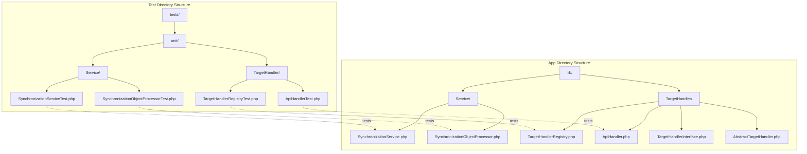
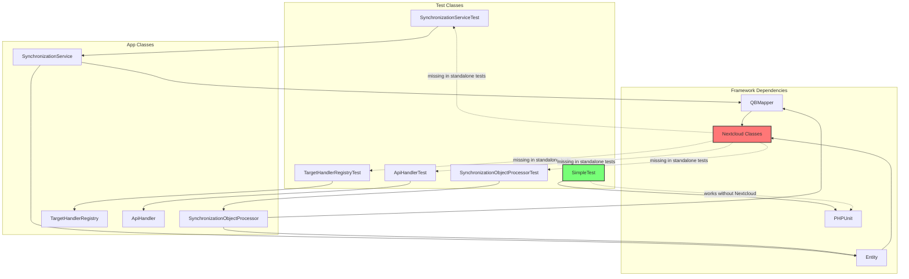
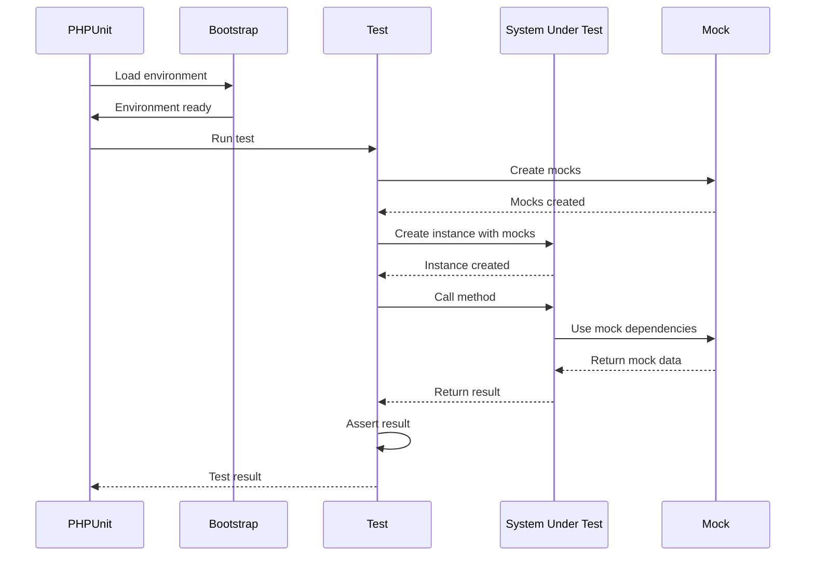
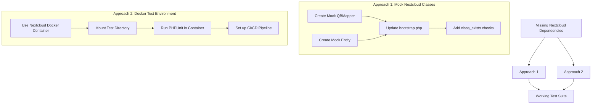

# Test Architecture Diagrams

## Test Structure

This diagram shows the structure of our test suite and how it corresponds to the application code:

## Test Dependencies

This diagram illustrates the dependencies of our tests and the challenges with Nextcloud classes:

## Test Execution Flow

This diagram shows the flow of test execution:

## Solution Approaches

This diagram illustrates two possible approaches to solve the dependency issues:

