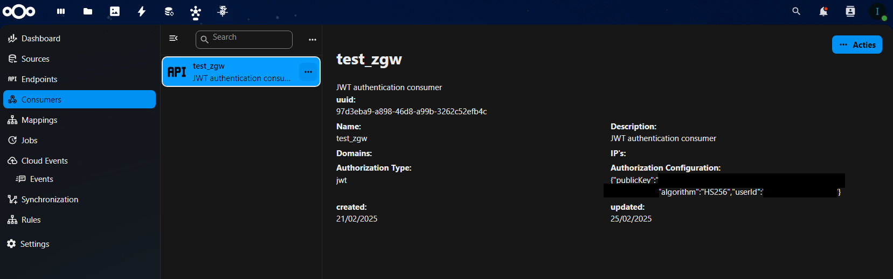
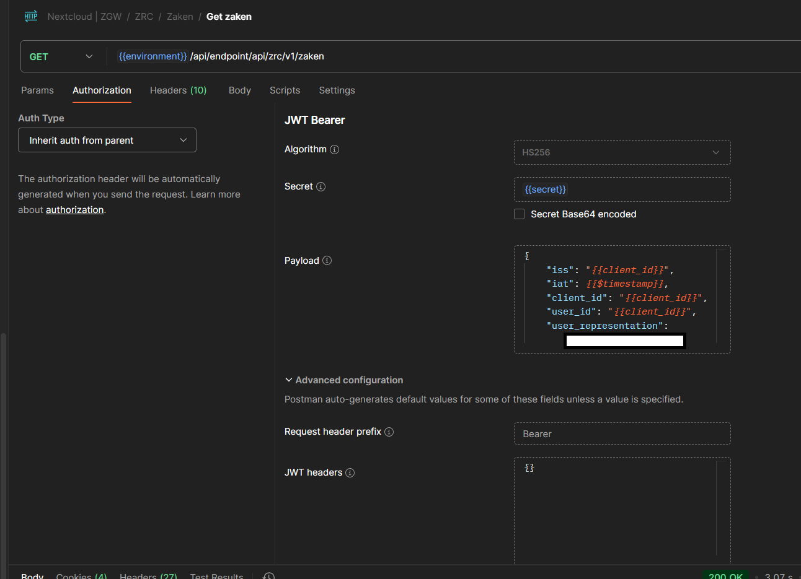

# Endpoints

Endpoints are used to fetch data from a source (api or OpenRegister register etc). You can apply mapping and rules on a endpoint

## Creating a endpoint

Endpoints only need a `endpoint` (path), `targetType` and `targetId`.

Endpoint array and regex are automatically generated based on input of `endpoint`.

`endpoint` may not start with an / but just the first path as text. Like `api/v1/zaken`. 

If you want your endpoint to also be useed to fetch single item you need to add `{{id}}` as the last path. `api/v1/zaken/{{id}}`. 

For each method you want your endpoint to be accessed with you need to create a separate one with a separate method, everything else can be the same. Make sure to clarify the method in your title.

If your endpoint needs to fetch data from OpenRegister the `targetType` needs to be register/schema and the `targetId` registerId/schemaId 

For example ZGW zaken endpoint:

## Sub endpoints

If you have for example a endpoint that looks like `v1/zaken/{zaak_uuid}/zaakeigenschappen/{eigenschap_uuid}` your path of endpoint needs to be like: v1/zaken/{{id}}/zaakeigenschappen/{{schematitlelowercaps_id}} for example: `v1/zaken/{{id}}/zaakeigenschappen/{{zaakeigenschap_id}}` where zaakeigenschap is the title of a configured schema in OpenRegister called ZaakEigenschap.

## Authorization

Endpoints can be publically accessed or if viable authorised with jwt. 

For public access you would have to do nothing, this is currently by default.

For jwt auth you need to create a consumer in OpenConnector where its name will be your clientId and the publicKey in the authorization configuration will be your secret.
The userId in authorization configuration needs to be the username of the admin user.

See the following example:

This will be automatically be attached to every created endpoint and currently cannot be more specifically configured.

This is how authorization would look like in Postman:

