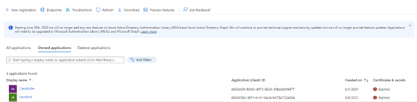
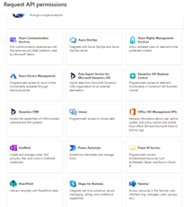
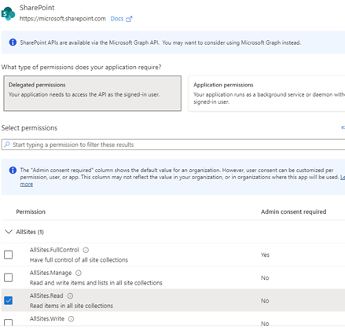
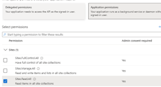
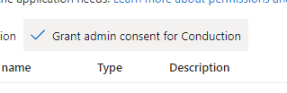
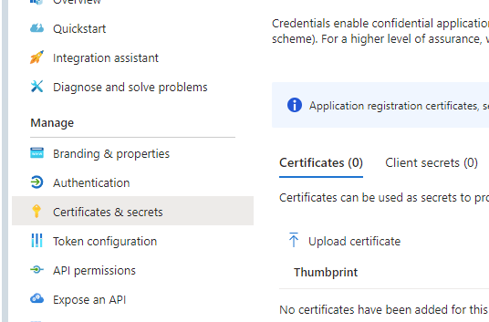
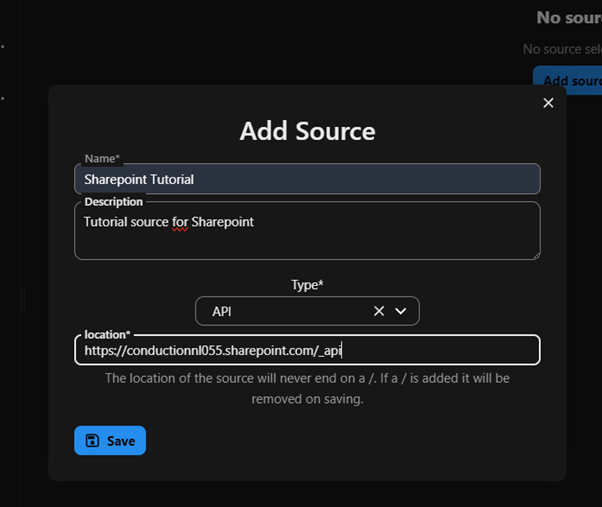
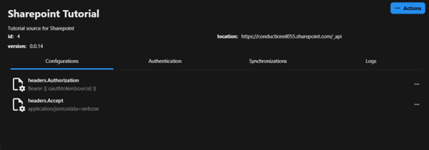

# SharePoint Integration with OpenConnector

SharePoint is Microsoft's document management and collaboration platform that allows organizations to store, organize, share, and access information securely. Many organizations, especially government institutions, use SharePoint to manage their internal documents and workflows.

## Why Connect to SharePoint?

In the context of Open Data and specifically the Dutch WOO (Wet Open Overheid - Open Government Act), organizations need to make certain documents publicly accessible. However, these documents often reside in internal SharePoint environments. OpenConnector provides a seamless solution to bridge this gap.

## Example: WOO Documents Publication Flow

Let's walk through how OpenConnector can automatically publish WOO documents from SharePoint to Open Catalogi:

1. **SharePoint Connection Setup**
   - Configure OpenConnector with your SharePoint endpoint URL
   - Set up certificate-based authentication using your organization's certificates
   - Establish secure connection parameters

2. **Folder Structure Navigation**
   - OpenConnector systematically traverses through SharePoint folders
   - Identifies folders containing WOO documents
   - Reads metadata from folder labels and properties

3. **Publication Creation in Open Register**
   - For each SharePoint folder:
     - Creates a new publication object in Open Register
     - Maps SharePoint folder metadata to publication properties
     - Sets appropriate WOO categories and classifications
     - Establishes publication dates and visibility settings

4. **Document Synchronization**
   - Automatically syncs all documents from SharePoint folders
   - Maintains file integrity and metadata
   - Updates documents when source files change
   - Preserves version history and audit trail

This automated flow ensures that WOO documents are consistently and accurately published while maintaining security and compliance requirements.

## How to configure SharePoint authentication

### Prerequisites
- A Microsoft SharePoint instance managed with Microsoft Entra.
- A Nextcloud instance with OpenConnector installed.
- A valid X.509 certificate and the private key.
- A Linux command line (or Git Bash on Windows) for generating values later in the process.

### Setting up Microsoft Entra

#### Create an app
First, we need to register an appcreate an app registration in Microsoft Entra under ‘Identity’ → ‘Applications’ → ‘App registrations’. Give your app registration an appropriate name


This app registration needs API permissions for Sharepoint. We recommend this to limit this to AllSites.Read and Sites.Read.All.

Permissions are managed under the tab ‘API Permissions’. Click ‘Add’ and in the overlay click ‘Sharepoint’, ‘Application permissions’, and check the checkbox for ‘Sites.Read.All’, and click ‘Delegated permissions’, and check the checkbox ‘AllSites.Read’. Sites.






Then, press the button ‘Grant admin consent for {organization}’, or ask an Entra admin to grant this consent.



#### Add Certificate


Now, click the ‘Certificates & secrets’ tab in your app registration, then go to the ‘Certificates’ tab in the screen that is opened and click ‘Upload certificate’. Upload the public certificate (.crt or .pem) and press ‘add’.
The certificate will show up in the list now.


Later on, we will need the thumbprint of the certificate, so keep this screen open, or copy it and store it for the time being.

### Setting up a source


Next, we need to set up the source in OpenConnector. Open your Nextcloud instance and go to OpenConnector, click sources and click the ‘Add source’ button.

In the next modal, add a name, description and the location of SharePoint (usually https://{tenant}.sharepoint.com/_api), and set Type to API.
Set up the source authentication
Now, click the ‘Authentication’ tab in the new source, and click ‘add Authentication’ in the ‘Actions’ menu.
Add the key grant_type with value client_credentials and click ‘Save’. Repeat this step for the following values (grant type is added again for reference, italic values can be copied without editing):

| Key                   | Value                                                                                                                                                                                                                                    | Note                                                                                                                             |
|-----------------------|------------------------------------------------------------------------------------------------------------------------------------------------------------------------------------------------------------------------------------------|----------------------------------------------------------------------------------------------------------------------------------|
| grant_type            | _client_credentials_                                                                                                                                                                                                                     |                                                                                                                                  |
| scope                 | `https://{sharepoint url}/.default`                                                                                                                                                                                                      | See above for the default URL                                                                                                    |
| authentication        | _body_                                                                                                                                                                                                                                   |                                                                                                                                  |
| client_id             | the client ID of the app registration                                                                                                                                                                                                    | See ‘Obtain client and tenant id’                                                                                                |
| client_secret         | Empty string, due to OAuth boundaries this is a mandatory key                                                                                                                                                                            |                                                                                                                                  | 
| client_assertion_type | _urn:ietf:params:oauth:client-assertion-type:jwt-bearer_                                                                                                                                                                                 |                                                                                                                                  |
| private_key           | The base64 encoded private key of the certificate                                                                                                                                                                                        | Highly recommended using a secret manager for storing the private key.                                                           |
| x5t                   | The sha1 of the thumbprint                                                                                                                                                                                                               | See ‘Obtain x5t value’                                                                                                           |
| payload               | ```{"aud": "{tokenUrl}","exp": {{ 'now'\|date_modify('+15 minutes')\|date('U') }},"iss": "{client_id}","jti":"dfdaa67d-d76e-48c4-a349-58861983869e","nbf": {{ 'now'\|date('U') }},"sub": "{client_id}","iat": {{ 'now'\|date('U') }}}``` | Replace `{tokenUrl}` by the same value as ‘tokenUrl’ (see below) and `{client_id}` by the same value as ‘client_id’ (see above)  |
| tokenUrl              | `https://login.microsoftonline.com/{microsoft tenant id}/oauth2/v2.0/token`                                                                                                                                                              | Replace {microsoft tenant id} by your Microsoft Tenant ID (see ‘Obtain client and tenant id’)                                    |


#### Obtain client and tenant ID


As seen in the table above, there are two locations where the client ID has to be inserted into the source, and likewise two locations where the Tenant ID must be inserted (both times in the token URL).

The client ID can be obtained from the Microsoft Entra dashboard by clicking on ‘Overview’ in the App registration, and copying the value ‘Application (client) ID’ in essentials.

The Tenant ID can be found in the same list, as ‘Directory (tenant) ID’

#### Obtain x5t value
The x5t value is an encoded version of the SHA1 thumbprint we obtained in the Add certificate section.
To encode this value we can use the command line.

In a linux (or git bash) command line we need the following command:
```bash
echo '{thumbprint}' | xxd -r -p | base64
```

The resulting string we can enter into the x5d value.

#### Set configuration fields


Now that we have the authentication values, we can set the configuration fields.
We click the tab ‘Configurations’ and in the Actions menu select ‘add configuration’.
Here we need to fill two fields. The first field to fill is ‘headers.Authorization’, with the value ‘Bearer {{ oauthToken(source) }}’, and the other one is ‘headers.Accept’ with value ‘application\/json;odata=verbose’

### Test the source
Now we should be done setting up the source, we can now click ‘Test’ in the Actions menu. In the field ‘endpoint’ we enter ‘/Web/lists’ and press ‘Test connection’. If the response gives a successful response (Status: OK (200)), the source is configured correctly.


## How to configure SharePoint for Woo

SharePoint can be used as a source for publishing Woo requests and decisions. To enable this, a specific folder must be set up where publications are stored. Access to these publications can then be obtained via an endpoint.

### Structure of the Publication Folders

Each publication is represented by a separate folder within the main publication directory. All associated documents and attachments are stored within this folder.

That would result in a API endpoint which can be used retrieve publications: `/_api/Web/GetFolderByServerRelativePath(decodedurl='/WOO/Woo-verzoeken en -besluiten')/folders`
It is recommended to store all publications in one central folder. (you dont have to make separate folders for each Woo category as in the example, just put them all in one big folder)


One folder in the big parent folder represents one publication.


Where within you can store the documents belonging to the publication.


### Configuring Metadata in SharePoint

To properly manage and structure publications, SharePoint must be configured to allow metadata to be added per publication folder. This ensures that publications comply with the requirements of [OpenWOO](https://openwoo.app/Techniek/Configuratie/).


Open settings.


View library settings.


Go to more library settings.


Navigate to Enterprise Metadata and Keywords settings.


Enable the Enterprise Keywords option and press OK.


Create a column for each configuration field from [OpenWOO](https://openwoo.app/Techniek/Configuratie/).


Here you can configure the columns, make sure to enable default view.


Example of minimal configuration.


Example of an extended configuration including all optional fields.


### Modifying publication metadata

To update the metadata of a publication:
1. Open the document library and view the publications folder.
2. Click on Grid edit to enter or modify metadata.
3. After entering the data, click Exit grid in the upper-left corner to save the changes.


